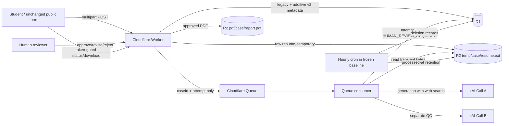

# Baseline architecture diagram

Privacy boundary: raw resume bytes exist only in temporary R2 and transient Worker/model-call memory. D1 and Queue carry structured/sanitized facts and identifiers, never raw resume text or contact details. Human review remains the only release path.
